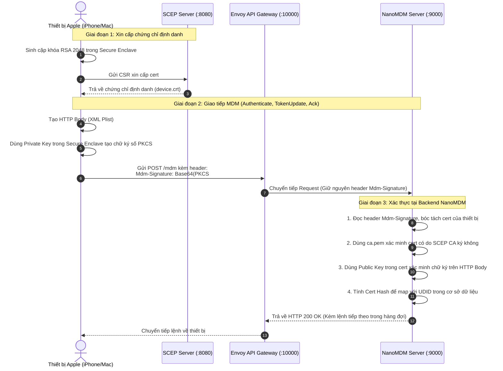

# Hướng Dẫn Tích Hợp Envoy API Gateway Cho Hệ Thống Apple MDM

> **Tài liệu thiết kế & triển khai:** Hướng dẫn chi tiết cách đặt **Envoy Proxy** ở tầng trước làm **API Gateway** tập trung cho toàn bộ hệ thống Apple MDM (NanoMDM, SCEP CA và Web Enrollment Portal).

---

## 📑 Mục Lục
1. [Tại Sao Cần Envoy API Gateway?](#1-tại-sao-cần-envoy-api-gateway)
2. [Mô Hình Kiến Trúc (Trước & Sau Tích Hợp)](#2-mô-hình-kiến-trúc-trước--sau-tích-hợp)
3. [Bảng Định Tuyến & Ma Trận Phân Quyền (Routing & Access Matrix)](#3-bảng-định-tuyến--ma-trận-phân-quyền)
4. [Hướng Dẫn Triển Khai Từng Bước](#4-hướng-dẫn-triển-khai-từng-bước)
   - [Bước 1: Tạo file cấu hình Envoy (envoy.yaml)](#bước-1-tạo-file-cấu-hình-envoy-envoyyaml)
   - [Bước 2: Khởi chạy Envoy Proxy](#bước-2-khởi-chạy-envoy-proxy)
   - [Bước 3: Cập nhật hồ sơ đăng ký (enroll.mobileconfig)](#bước-3-cập-nhật-hồ-sơ-đăng-ký-enrollmobileconfig)
   - [Bước 4: Cấu hình Tunnel ra ngoài Internet](#bước-4-cấu-hình-tunnel-ra-ngoài-internet)
   - [Bước 5: Kiểm tra kết nối qua Gateway](#bước-5-kiểm-tra-kết-nối-qua-gateway)
5. [Tùy Chọn Nâng Cao: Đóng Gói Toàn Diện với Docker Compose](#5-tùy-chọn-nâng-cao-đóng-gói-toàn-diện-với-docker-compose)
6. [Cơ Chế Xác Thực Thiết Bị: mTLS vs. SignMessage](#6-cơ-chế-xác-thực-thiết-bị-mtls-vs-signmessage)
7. [Các Lưu Ý Sống Còn Với Giao Thức Apple MDM](#7-các-lưu-ý-sống-còn-với-giao-thức-apple-mdm)

---

## 1. Tại Sao Cần Envoy API Gateway?

Hiện tại, hệ thống MDM đang chia nhỏ thành 3 dịch vụ hoạt động độc lập trên 3 cổng:
* **Web Portal (`serve.py`):** Cổng `8000` (Phục vụ tải file cấu hình qua Safari).
* **SCEP CA Server:** Cổng `8080` (Tiếp nhận CSR và ký chứng chỉ thiết bị).
* **NanoMDM Server:** Cổng `9000` (Tiếp nhận `Check-in`, `Acknowledge` từ thiết bị và cung cấp API quản trị `/v1/`).

### Những vấn đề khi chưa có Gateway:
1. **Phân mảnh Domain & Port:** Cần mở 3 cổng khác nhau trên firewall hoặc phải chạy 2–3 Cloudflare Quick Tunnel rời rạc.
2. **Nguy cơ bảo mật cổng Admin:** NanoMDM phục vụ cả thiết bị MDM (`/mdm`) và API điều khiển tối cao (`/v1/enqueue`, `/v1/pushcert`) trên cùng cổng 9000. Nếu public trực tiếp cổng 9000 ra ngoài Internet, bất kỳ ai cũng có thể dò quét API quản trị.
3. **Thiếu khả năng giám sát tập trung:** Không có một nơi ghi nhận toàn bộ access logs, latency, rate limiting hoặc thống kê lưu lượng thiết bị.

### Lợi ích khi đặt Envoy làm Gateway:
* **Quy về 1 Domain duy nhất:** Toàn bộ hệ thống chỉ cần 1 URL công khai (ví dụ: `https://mdm.yourdomain.com`).
* **Bảo vệ Admin API:** Envoy đóng vai trò firewall tầng L7, chặn mọi request `/v1/*` từ Internet và chỉ cho phép máy nội bộ/VPN gọi vào.
* **Tương thích hoàn hảo với Apple MDM:** Envoy hỗ trợ bảo toàn header `Mdm-Signature`, xử lý payload lớn của plist và hỗ trợ HTTP/2 chuẩn cho thiết bị iOS/macOS.

---

## 2. Mô Hình Kiến Trúc (Trước & Sau Tích Hợp)

### 2.1. Mô hình Hiện tại (Chưa có Gateway):
```text
  [Safari]       [Thiết bị Apple]    [Thiết bị Apple]     [Admin (cmdr.py)]
     |                  |                   |                     |
 (Port 8000)        (Port 8080)         (Port 9000)           (Port 9000)
     v                  v                   v                     v
+----------+      +-------------+     +---------------------------------+
| serve.py |      | SCEP Server |     |         NanoMDM Server          |
|  Portal  |      |  (CA Depot) |     | (/mdm Device)  (/v1 Admin API)  |
+----------+      +-------------+     +---------------------------------+
```

### 2.2. Mô hình Mới (Có Envoy API Gateway):
```text
      [Safari]       [Thiết bị Apple]    [Admin (curl / cmdr.py)]
         |                  |                       |
         +------------------+-----------------------+
                            |
                     (HTTPS / 1 Domain)
                            v
             +------------------------------+
             |   Envoy API Gateway (L7)     |
             |       (Port 10000 / 443)     |
             +------------------------------+
               |            |             |
      Path: /scep*      Path: /mdm*    Path: /v1/* (Chặn từ Internet)
               |            |             | (Chỉ cho phép Localhost/VPN)
               v            v             v
        +-----------+    +-----------------------+     Path: / & static
        | SCEP CA   |    |    NanoMDM Server     |           |
        | (:8080)   |    |       (:9000)         |           v
        +-----------+    +-----------------------+     +-----------+
                                                       | serve.py  |
                                                       | (:8000)   |
                                                       +-----------+
```

---

## 3. Bảng Định Tuyến & Ma Trận Phân Quyền

| Đường dẫn (Path Match) | Backend Cluster | Cổng nội bộ | Quyền truy cập (Access Control) | Mục đích |
| :--- | :--- | :--- | :--- | :--- |
| `/` & `/enroll.mobileconfig` | `portal_service` | `127.0.0.1:8000` | **Public** (Internet) | Người dùng mở Safari tải profile đăng ký |
| `/scep*` | `scep_service` | `127.0.0.1:8080` | **Public** (Internet) | Thiết bị gửi CSR xin cấp chứng chỉ số |
| `/mdm*` | `nanomdm_service` | `127.0.0.1:9000` | **Public** (Internet) | Giao thức MDM (Authenticate, TokenUpdate, Ack) |
| `/v1/*` | `nanomdm_service` | `127.0.0.1:9000` | **Private Only** (Local/VPN) | API nạp lệnh điều khiển và nạp cert APNs |

---

## 4. Hướng Dẫn Triển Khai Từng Bước

### Bước 1: Tạo file cấu hình Envoy (`envoy.yaml`)

Tạo file `envoy/envoy.yaml` trong thư mục dự án với nội dung như sau:

```yaml
static_resources:
  listeners:
  - name: listener_http
    address:
      socket_address:
        address: 0.0.0.0
        port_value: 10000
    filter_chains:
    - filters:
      - name: envoy.filters.network.http_connection_manager
        typed_config:
          "@type": type.googleapis.com/envoy.extensions.filters.network.http_connection_manager.v3.HttpConnectionManager
          stat_prefix: ingress_http
          codec_type: AUTO
          route_config:
            name: mdm_routes
            virtual_hosts:
            - name: mdm_virtual_host
              domains: ["*"]
              routes:
              # 1. Bảo vệ API Admin /v1/: Nếu cần chỉ cho phép gọi từ localhost
              # Có thể bổ sung chặn theo Remote IP hoặc giữ route nội bộ
              - match:
                  prefix: "/v1/"
                route:
                  cluster: nanomdm_cluster
                  timeout: 30s

              # 2. Định tuyến SCEP CA
              - match:
                  prefix: "/scep"
                route:
                  cluster: scep_cluster
                  timeout: 30s

              # 3. Định tuyến giao thức MDM Apple
              - match:
                  prefix: "/mdm"
                route:
                  cluster: nanomdm_cluster
                  timeout: 60s

              # 4. Web Portal tải hồ sơ (fallback root)
              - match:
                  prefix: "/"
                route:
                  cluster: portal_cluster
                  timeout: 15s

          http_filters:
          - name: envoy.filters.http.router
            typed_config:
              "@type": type.googleapis.com/envoy.extensions.filters.http.router.v3.Router

  clusters:
  # Cluster 1: Web Portal (serve.py)
  - name: portal_cluster
    connect_timeout: 0.5s
    type: STRICT_DNS
    lb_policy: ROUND_ROBIN
    load_assignment:
      cluster_name: portal_cluster
      endpoints:
      - lb_endpoints:
        - endpoint:
            address:
              socket_address:
                address: 127.0.0.1
                port_value: 8000

  # Cluster 2: SCEP CA Server
  - name: scep_cluster
    connect_timeout: 0.5s
    type: STRICT_DNS
    lb_policy: ROUND_ROBIN
    load_assignment:
      cluster_name: scep_cluster
      endpoints:
      - lb_endpoints:
        - endpoint:
            address:
              socket_address:
                address: 127.0.0.1
                port_value: 8080

  # Cluster 3: NanoMDM Core Server
  - name: nanomdm_cluster
    connect_timeout: 0.5s
    type: STRICT_DNS
    lb_policy: ROUND_ROBIN
    load_assignment:
      cluster_name: nanomdm_cluster
      endpoints:
      - lb_endpoints:
        - endpoint:
            address:
              socket_address:
                address: 127.0.0.1
                port_value: 9000
```

---

### Bước 2: Khởi chạy Envoy Proxy

Khởi động container Envoy sử dụng chế độ `--network host` (để Envoy dễ dàng trỏ tới các port `127.0.0.1` của máy host):

```bash
docker run -d --name envoy-gateway \
  --restart unless-stopped \
  --network host \
  -v $(pwd)/envoy/envoy.yaml:/etc/envoy/envoy.yaml \
  envoyproxy/envoy:v1.28-latest
```

Kiểm tra trạng thái Envoy:
```bash
curl -I http://127.0.0.1:10000/
# Sẽ nhận phản hồi HTTP 200 OK từ Web Portal (serve.py)
```

---

### Bước 3: Cập nhật hồ sơ đăng ký (`enroll.mobileconfig`)

Mở file `nanomdm-server/enroll.mobileconfig`. Trước đây SCEP và NanoMDM cần 2 domain riêng, bây giờ bạn chỉ cần **1 domain duy nhất** trỏ vào Envoy:

```xml
<!-- Dòng 18-20: Cấu hình SCEP URL -->
<key>URL</key>
<string>https://mdm.yourdomain.com/scep</string>

<!-- Dòng 51-53: Cấu hình NanoMDM ServerURL -->
<key>ServerURL</key>
<string>https://mdm.yourdomain.com/mdm</string>
```

---

### Bước 4: Cấu hình Tunnel ra ngoài Internet

Thay vì tạo nhiều tunnel cho từng cổng 8000, 8080, 9000, bạn chỉ cần chạy **duy nhất 1 Cloudflare Tunnel** hướng về cổng Envoy:

```bash
cloudflared tunnel --url http://localhost:10000
```
*Ghi nhận domain HTTPS được cấp (ví dụ: `https://my-mdm-gateway.trycloudflare.com`) và cập nhật vào `enroll.mobileconfig`.*

---

### Bước 5: Kiểm tra kết nối qua Gateway

Chạy các lệnh kiểm tra sau để xác nhận Envoy đã route chính xác đến từng backend:

1. **Kiểm tra Web Portal:**
   ```bash
   curl -s http://127.0.0.1:10000/ | grep "NanoMDM"
   ```
2. **Kiểm tra SCEP CA:**
   ```bash
   curl -s "http://127.0.0.1:10000/scep?operation=GetCACert" | head -c 20
   ```
3. **Kiểm tra NanoMDM Admin API (Nội bộ):**
   ```bash
   curl -s -u nanomdm:nanomdm http://127.0.0.1:10000/v1/pushcert
   ```

---

## 5. Tùy Chọn Nâng Cao: Đóng Gói Toàn Diện với Docker Compose

Nếu muốn khởi động toàn bộ hệ thống (Envoy + SCEP + NanoMDM + Portal) chỉ bằng một lệnh `docker compose up -d`, có thể sử dụng file `docker-compose.yml` như sau:

```yaml
version: '3.8'

services:
  gateway:
    image: envoyproxy/envoy:v1.28-latest
    container_name: mdm-gateway
    volumes:
      - ./envoy/envoy.yaml:/etc/envoy/envoy.yaml:ro
    ports:
      - "10000:10000"
    depends_on:
      - scep
      - nanomdm
      - portal

  scep:
    image: micromdm/scep:latest
    container_name: mdm-scep
    command: ["-allowrenew", "0"]
    volumes:
      - ./scep/depot:/depot

  nanomdm:
    build:
      context: ./nanomdm-server
      dockerfile: Dockerfile
    container_name: mdm-core
    command: ["./nanomdm-linux-amd64", "-ca", "/ca.pem", "-api", "nanomdm"]
    volumes:
      - ./ca.pem:/ca.pem:ro
      - ./nanomdm-server/dbkv:/app/dbkv

  portal:
    image: python:3.11-alpine
    container_name: mdm-portal
    working_dir: /app
    volumes:
      - ./nanomdm-server:/app:ro
    command: ["python3", "serve.py"]
```

---

## 6. Cơ Chế Xác Thực Thiết Bị: mTLS vs. SignMessage

Trong giao thức Apple MDM, việc xác thực thiết bị và chống giả mạo được Apple hỗ trợ thông qua **hai cơ chế**:

### 6.1. Phân biệt 2 cơ chế

| Đặc điểm | Cơ chế 1: mTLS Tầng Mạng (Network-level mTLS) | Cơ chế 2: Ký số Ứng dụng (`SignMessage: true`) *(Dự án đang dùng)* |
| :--- | :--- | :--- |
| **Tầng hoạt động** | Tầng 4 / TLS Handshake | Tầng 7 / HTTP Header (`Mdm-Signature`) |
| **Cách gửi cert** | Thiết bị gửi `device.crt` trong bước TLS `Certificate` | Thiết bị đính kèm `device.crt` vào chữ ký PKCS#7 trong header |
| **Cách chứng minh sở hữu** | Ký gói tin `CertificateVerify` lúc bắt tay TLS | Ký toàn bộ HTTP Body (XML Plist) bằng Private Key |
| **Qua Reverse Proxy / Tunnel** | **Rất khó khăn:** Proxy kết thúc TLS (TLS Termination) sẽ làm đứt chuỗi mTLS nếu không có L4 TCP passthrough. | **Hoàn hảo:** Proxy L7 / Envoy / Cloudflare chuyển tiếp HTTP bình thường, header không bị ảnh hưởng. |
| **Cấu hình Profile** | Mặc định (hoặc `SignMessage` để `false`) | Bắt buộc bật `<key>SignMessage</key><true/>` trong payload MDM |

---

### 6.2. Luồng hoạt động chi tiết của `SignMessage` (End-to-End)



---

### 6.3. Hai kịch bản triển khai với Envoy API Gateway

#### Kịch bản A: Envoy làm L7 Reverse Proxy trong suốt (Khuyên Dùng)
* **Nguyên lý:** Envoy chỉ đóng vai trò reverse proxy thông thường, terminate TLS công khai (từ Cloudflare Tunnel hoặc Let's Encrypt), sau đó chuyển tiếp HTTP nguyên vẹn vào NanoMDM.
* **Xác thực:** NanoMDM tự giải mã header `Mdm-Signature` và đối chiếu với CA qua tham số `./nanomdm-linux-amd64 -ca ../ca.pem`.
* **Cấu hình:** Sử dụng file `envoy/envoy.yaml` chuẩn (như trong hướng dẫn Bước 1).
* **Ưu điểm:** Cực kỳ linh hoạt, tương thích 100% với Cloudflare Quick Tunnel, ngrok hoặc bất kỳ Ingress Controller nào.

#### Kịch bản B: Envoy đóng vai trò mTLS Termination trực tiếp tại Cổng vào (Nâng Cao)
* **Nguyên lý:** Thiết bị kết nối trực tiếp vào Envoy (cổng 443 hoặc port riêng). Envoy yêu cầu và xác thực `device.crt` của thiết bị ngay tại bước bắt tay TLS L4.
* **Cấu hình mẫu trên Envoy:**
  ```yaml
  transport_socket:
    name: envoy.transport_sockets.tls
    typed_config:
      "@type": type.googleapis.com/envoy.extensions.transport_sockets.tls.v3.DownstreamTlsContext
      common_tls_context:
        tls_certificates:
        - certificate_chain: { filename: "/etc/envoy/server.crt" }
          private_key: { filename: "/etc/envoy/server.key" }
        validation_context:
          trusted_ca:
            filename: "/etc/envoy/ca.pem"  # SCEP Root CA để xác thực thiết bị
      require_client_certificate: true
  ```
* **Lưu ý:** Kịch bản này **không thể** đi qua Cloudflare Quick Tunnel (vì Cloudflare chấm dứt TLS trước khi tới Envoy), mà đòi hỏi bạn phải có IP Public tĩnh và mở cổng trực tiếp cho Envoy.

---

## 7. Các Lưu Ý Sống Còn Với Giao Thức Apple MDM

1. **Header `Mdm-Signature`:**
   * Trong `enroll.mobileconfig`, tham số `<key>SignMessage</key><true/>` yêu cầu thiết bị Apple ký số vào toàn bộ HTTP body và đính kèm vào header `Mdm-Signature`.
   * **Envoy mặc định giữ nguyên (preserve) mọi HTTP header tùy biến**, không làm thay đổi hay gọt bỏ header này, giúp NanoMDM giải mã định danh thiết bị hoàn toàn bình thường.
2. **Buffer size & Large Plists:**
   * Khi thực thi các lệnh như `CertificateList`, `InstalledApplicationList`, iPhone/Mac sẽ phản hồi danh sách XML Plist rất lớn (có thể từ vài trăm KB đến 5MB).
   * Trong cấu hình Envoy, không nên giới hạn buffer quá nhỏ. Nếu cần điều chỉnh, hãy cấu hình `max_request_headers_kb: 96` trong `http_connection_manager`.
3. **MIME type file `.mobileconfig`:**
   * Trình duyệt Safari trên iOS/macOS chỉ tự động bật giao diện cài đặt profile khi nhận được header `Content-Type: application/x-apple-aspen-config`.
   * Script `serve.py` đã cung cấp sẵn header này. Envoy đóng vai trò reverse proxy sẽ chuyển tiếp chính xác header này về máy khách mà không bị biến đổi thành `text/plain`.
4. **Bảo vệ cổng Admin `/v1/*`:**
   * Nếu đưa Envoy ra Internet, hãy đảm bảo các route `/v1/*` được cấu hình IP Whitelist hoặc chặn trực tiếp trên Envoy bằng `direct_response` (HTTP 403 Forbidden) cho các request không đến từ mạng nội bộ.
